# API Gateway

[](https://golang.org/)
[](https://opensource.org/licenses/MIT)

The primary entry point for the E-Commerce Microservice Platform, responsible for routing external HTTP traffic to internal gRPC services.

## 📖 Overview

This service acts as a reverse proxy, security checkpoint, and orchestration layer for the entire platform. Its core responsibilities include:

*   **Protocol Translation:** Translating incoming public HTTP/REST requests into specific, internal gRPC calls.
*   **Authentication & Authorization:** Verifying JWTs for protected routes and enforcing Role-Based Access Control (RBAC) to restrict access (e.g., Admin-only endpoints).
*   **Single Point of Entry:** Providing a unified and consistent API surface for all external clients, hiding the complexity of the internal microservice architecture.
*   **Centralized Cross-Cutting Concerns:** Handling observability (metrics, initial traces) and security at the edge of the system.

## 🚀 Architecture

The API Gateway sits between the end-user and the internal microservice network. It uses a middleware chain to process requests before they are routed to the appropriate backend service.

```mermaid
graph LR
    U[👤 User] -- HTTP/REST --> GW[🌐 API Gateway];

    subgraph "Internal gRPC Network"
        GW -- gRPC --> US[🧑‍💼 User Service];
        GW -- gRPC --> PS[📦 Product Service];
        GW -- gRPC --> CS[🛒 Cart Service];
        GW -- gRPC --> OS[📬 Order Service];
    end

    subgraph "Observability Stack"
      GW -- Traces --> JAEGER[(🔍 Jaeger)];
      GW -- Metrics --> PROM[(📊 Prometheus)];
      GW -- Logs --> EFK[(📝 EFK Stack)];
    end
```



A typical request flows through the following middleware layers within the gateway:
1.  **Observability Middleware (`otelfiber`, `fiberprometheus`):** Creates the root span for distributed tracing and records metrics for the request.
2.  **Security Middleware:** Checks for a valid JWT and verifies user roles for protected endpoints.
3.  **Request Handler:** Forwards the request to the corresponding internal service via a gRPC client call.

## 🛠️ Tech Stack

| Category | Technology |
| :--- | :--- |
| **Language** | Go |
| **Web Framework** | Fiber (v2) |
| **Communication** | gRPC (Client) |
| **Observability** | OpenTelemetry (`otelfiber`), Prometheus (`fiberprometheus`), Zap |
| **Containerization** | Docker |

## ⚙️ Setup & Running

This service is designed to be run as part of the complete platform using Docker Compose.

### Prerequisites

*   Docker & Docker Compose
*   All project repositories must be cloned at the same directory level.

### Running

The service is automatically built and started when you run the main `docker-compose up` command from the `docker-compose-environment` repository.

For detailed instructions, please see the [main project README](https://github.com/ogozo/docker-compose-environment/blob/main/README.md).

### Environment Variables

The gateway is configured via the `env/gateway.env` file in the main compose directory.

| Variable | Description | Example |
| :--- | :--- | :--- |
| `HTTP_PORT` | The port on which the HTTP server listens. | `:3000` |
| `JWT_SECRET_KEY`| Secret key for signing and verifying JWTs. | `super-secret-key` |
| `USER_SERVICE_URL`| Address of the User gRPC service. | `service-user:50051` |
| `PRODUCT_SERVICE_URL`| Address of the Product gRPC service. | `service-product:50052` |
| `CART_SERVICE_URL` | Address of the Cart gRPC service. | `service-cart:50053` |
| `ORDER_SERVICE_URL` | Address of the Order gRPC service. | `service-order:50054` |
| `OTEL_SERVICE_NAME`| Service name for observability. | `api-gateway` |
| `OTEL_EXPORTER_OTLP_ENDPOINT`| OTLP endpoint for Jaeger. | `jaeger-tracer:4317` |

## 📡 API Endpoints

All paths are prefixed with `/api/v1`.

### User Authentication

**Register User**
*   **Endpoint:** `POST /register`
*   **Description:** Creates a new user with the `CUSTOMER` role.
*   **Security:** Public
*   **Request Body:**
    ```json
    {
      "email": "customer@example.com",
      "password": "password123"
    }
    ```

**Login User**
*   **Endpoint:** `POST /login`
*   **Description:** Authenticates a user and returns a JWT access token.
*   **Security:** Public
*   **Request Body:**
    ```json
    {
      "email": "customer@example.com",
      "password": "password123"
    }
    ```
*   **Success Response:**
    ```json
    {
      "access_token": "eyJhbGciOiJI..."
    }
    ```

### Products

**Get Product by ID**
*   **Endpoint:** `GET /products/:id`
*   **Description:** Retrieves details for a specific product.
*   **Security:** Public
*   **Example URL:** `GET /api/v1/products/c0eebc99-9c0b-4ef8-bb6d-6bb9bd380b11`

**Create Product**
*   **Endpoint:** `POST /products`
*   **Description:** Adds a new product to the catalog.
*   **Security:** Admin Role Required
*   **Request Body:**
    ```json
    {
      "name": "Go Gopher Plush Toy",
      "description": "A cuddly companion for coding sessions.",
      "price": 24.99,
      "stock_quantity": 500
    }
    ```

### Cart

**Get User Cart**
*   **Endpoint:** `GET /cart`
*   **Description:** Retrieves the current user's shopping cart.
*   **Security:** Authentication Required

**Add Item to Cart**
*   **Endpoint:** `POST /cart/items`
*   **Description:** Adds a product and quantity to the current user's cart.
*   **Security:** Authentication Required
*   **Request Body:**
    ```json
    {
      "product_id": "c0eebc99-9c0b-4ef8-bb6d-6bb9bd380b11",
      "quantity": 2
    }
    ```

### Orders

**Checkout**
*   **Endpoint:** `POST /checkout`
*   **Description:** Initiates the order creation process (Saga) using the items currently in the user's cart. Returns the initial `PENDING` state of the order.
*   **Security:** Authentication Required
